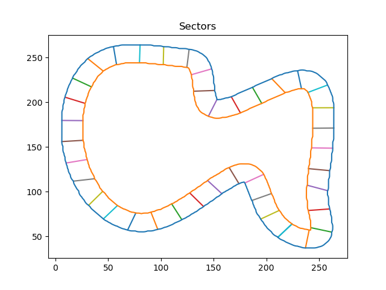
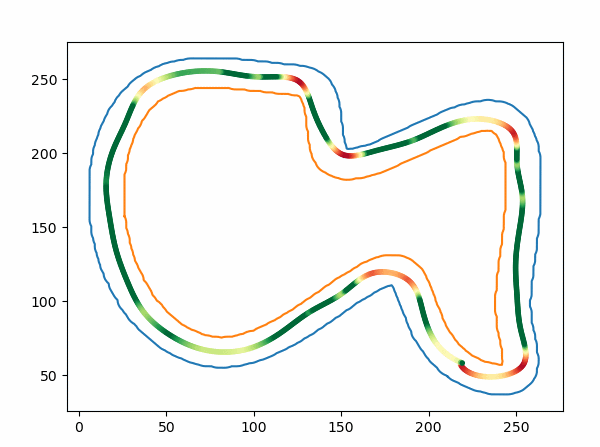

<h1 align="center">Racing Line Optimization with PSO</h1>

This repository contains a racing line optimization algorithm in python that uses **Particle Swarm Optimization**.

## Requirements

This version was developed and tested with ```python==3.8.12```. The following modules are required:
* ```matplotlib```
* ```numpy```
* ```scipy```
* ```shapely```


## How it works

First of all, we need to define the structure of the input data and which parameters the algorithm is optimizing.

### Data preprocessing
The _input data_ (i.e. the track layout) is stored in the ```tracks.json``` file: it consists of an array of points defining the central line of the track and the track width (which is considered constant along the track).

Then the algorithm will find the inner and outer track borders and define the search space of each sector (i.e. a segment that goes from one border to the other of the track). The points through which the racing line passes, will move along these segments:



### Run the algorithm

Run the ```main.py``` script to see the optimizer work. Inside the main function you will have the possibility to change the hyper-parameters of the PSO algorithm.

To find the racing line, the algorithm will fit a cubic spline to the sector points and compute the vehicle's speed at each point of the racing line with a simple formula using the coefficient of friction and the radius of the corner (optionally it is possible to add the down-force and the vehicle's mass).




## License

This project is under the MIT license. See [LICENSE](https://github.com/ParsaD23/Racing-Line-Optimization-with-PSO/blob/master/LICENSE) for more information.
